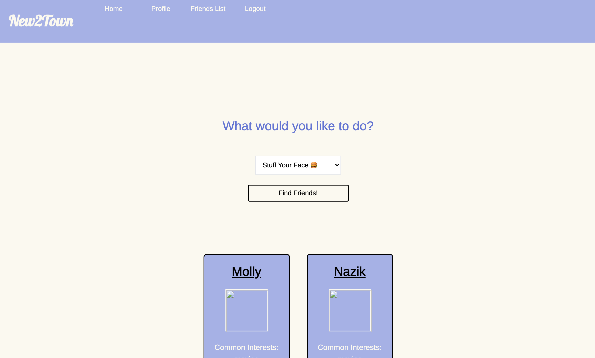
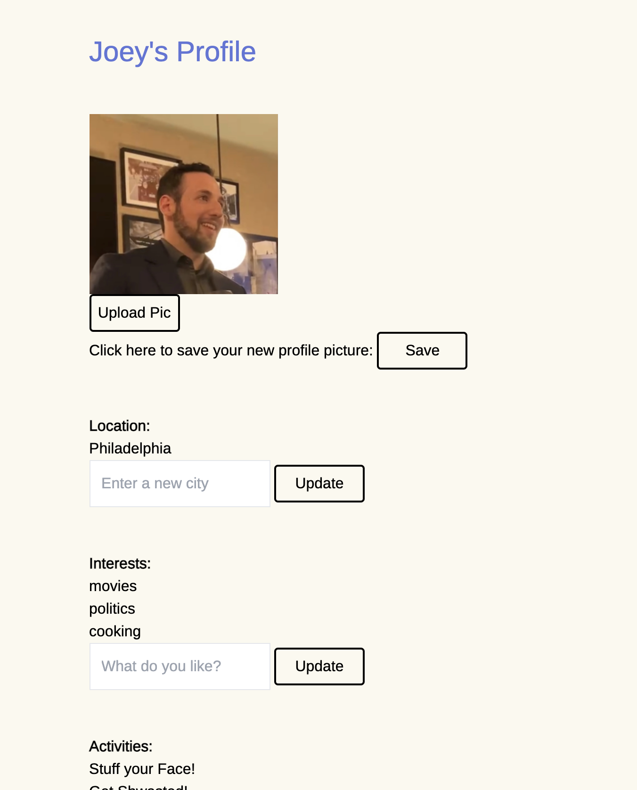
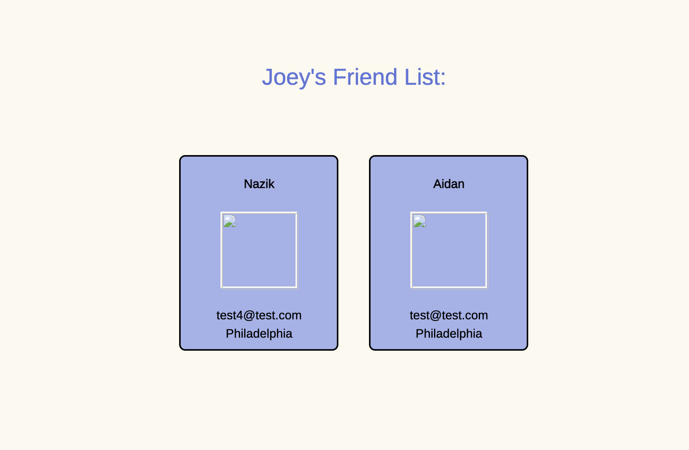
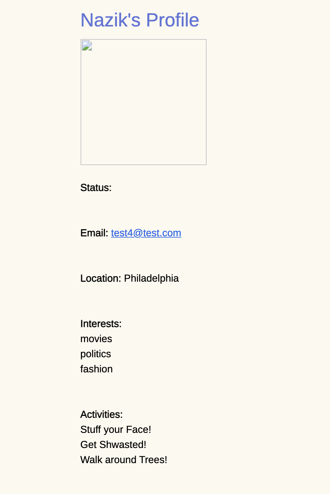

# new2town
## Description
- New2Town is a functional yet simple social media app focused one finding new people to be friends with in your area (Note: this is not a dating app).
- If you have recently moved to a new area sometimes it can be hard to make local friends. New2Town is an app dedicated to finding people who can help you explore your new home.
- 
## Table of Contents (Optional)
- [Installation](#installation)
- [Usage](#usage)
- [Credits](#credits)
- [License](#license)
- [Questions](#questions)
## Installation
- The project can be installed here: https://github.com/jfisher37/new2town

## Usage
- Sign up, search, add friends!
- There is a live build at https://new2town-jfisher37.herokuapp.com/

Please see images of the site below:

Homepage/search page:

User profile:

Friends List:

Friend's profile:

## Credits
- Principle dev team includes Joey Fisher, Molly Singmaster, Nazik Askarbekkyzy and Aidan Rich.
- Images are hosted by Cloudinary.

## License
- MIT License

Copyright (c) [2021] [Aidan Rich, Joey Fisher, Molly Singmaster, Nazik Askarbekkyzy]

Permission is hereby granted, free of charge, to any person obtaining a copy of this software and associated documentation files (the "Software"), to deal in the Software without restriction, including without limitation the rights to use, copy, modify, merge, publish, distribute, sublicense, and/or sell copies of the Software, and to permit persons to whom the Software is furnished to do so, subject to the following conditions:

The above copyright notice and this permission notice shall be included in all copies or substantial portions of the Software.

THE SOFTWARE IS PROVIDED "AS IS", WITHOUT WARRANTY OF ANY KIND, EXPRESS OR IMPLIED, INCLUDING BUT NOT LIMITED TO THE WARRANTIES OF MERCHANTABILITY, FITNESS FOR A PARTICULAR PURPOSE AND NONINFRINGEMENT. IN NO EVENT SHALL THE AUTHORS OR COPYRIGHT HOLDERS BE LIABLE FOR ANY CLAIM, DAMAGES OR OTHER LIABILITY, WHETHER IN AN ACTION OF CONTRACT, TORT OR OTHERWISE, ARISING FROM, OUT OF OR IN CONNECTION WITH THE SOFTWARE OR THE USE OR OTHER DEALINGS IN THE SOFTWARE.

## Badges

